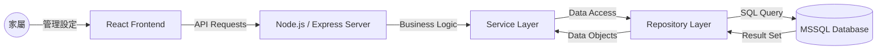
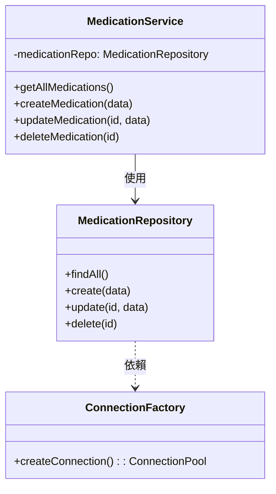
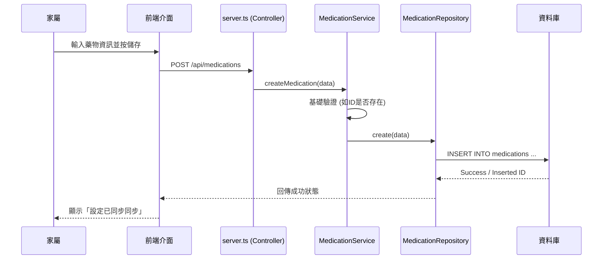

# 安心長照---家屬守護助手 - 產品需求與設計文件 (PRD & Design)

## 1. 產品概述
### 1.1 產品願景
透過遠端數據整合與即時通知，減輕家屬的照護壓力，確保長輩獲得精確且及時的照護支持。

### 1.2 目標對象
- 需要遠端照護父母或長輩的家屬。
- 居家照護服員或個案管理人員。

---

## 2. 系統架構圖 (System Architecture)

---

## 3. 核心功能需求
### 3.1 守護管理中心 (Console)
- **多對象監控**：快速切換不同長輩個案。
- **異常警報**：生理指標超過預設範圍或漏藥通知。

### 3.2 遠端計畫設定 (Care Planning)
- **用藥排程管理**：設定藥品、劑量、提醒頻率。
- **執行紀錄追蹤**：查看長輩端回傳的服藥 Log。

### 3.3 健康數據分析 (Health Analytics)
- **歷史趨勢**：心率、血壓、體溫數據的視覺化圖表。
- **就醫紀錄管理**：雲端儲存醫囑、診斷與回診時間。

---

## 4. 類別圖 (Class Diagram)

---

## 5. 業務流程循序圖 (Sequence Diagram)
### 以「家屬新增用藥提醒」為例：

---

## 6. 技術規格
- **後端技術**：Node.js + TypeScript + Express。
- **資料庫**：Azure SQL Database (MSSQL)。
- **開發模式**：Service-Repository 模式，確保商業邏輯與資料存取解耦。
