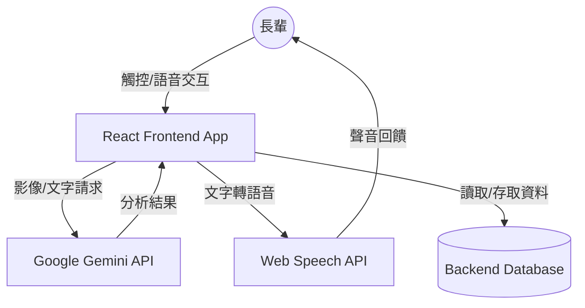
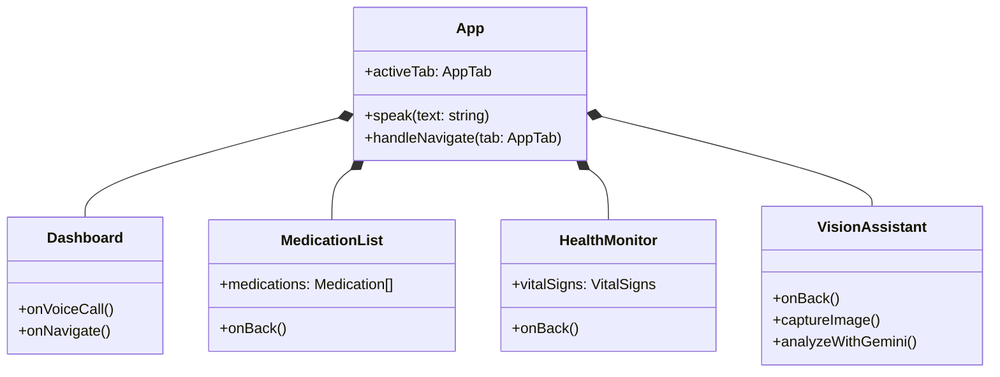
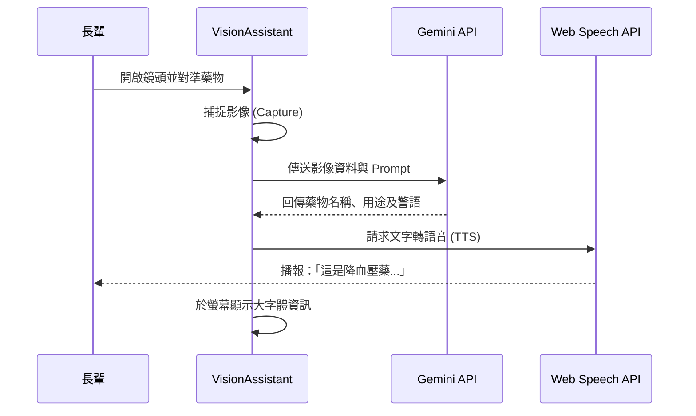

# 王爺爺智慧生活助手 - 產品需求與設計文件 (PRD & Design)

## 1. 產品概述
### 1.1 產品願景
打造一個無障礙、智慧化的銀髮生活助手，透過直觀的介面與 AI 技術，提升長輩的生活自主性與安全感。

### 1.2 目標對象
- 高齡長者（特別是需要用藥提醒或遠端照護者）。
- 科技接受度較低，需要語音或視覺輔助的族群。

---

## 2. 系統架構圖 (System Architecture)

---

## 3. 核心功能需求
### 3.1 智慧首頁 (Smart Dashboard)
- **今日摘要**：顯示當前時間、天氣、下一次服藥時間。
- **語音導引**：進入頁面時發出親切的語音問候。

### 3.2 用藥安全管理 (Medication Safety)
- **用藥清單**：大字體、高對比的藥物列表。
- **提醒確認**：一鍵確認已服藥，同步至家屬端。

### 3.3 生理指標監測 (Health Monitoring)
- **數據查看**：呈現心率、血壓、血氧等最新數據。
- **趨勢圖表**：以簡單易懂的方式呈現健康變化。

### 3.4 AI 智慧輔助 (AI Assistance)
- **視覺助理**：利用鏡頭辨識藥物或說明文字。
- **語音交互**：支援自然語言問答，減少手動操作。

---

## 4. 類別與組件圖 (Component Diagram)

---

## 5. 業務流程循序圖 (Sequence Diagram)
### 以「AI 視覺助理辨識藥物」為例：

---

## 6. 技術規格
- **前端框架**：React + Vite (RWD 響應式優化)。
- **AI 整合**：Google Gemini Pro Vision / Text。
- **介面設計**：超大字體、高對比色、大圖標、語音回饋。
